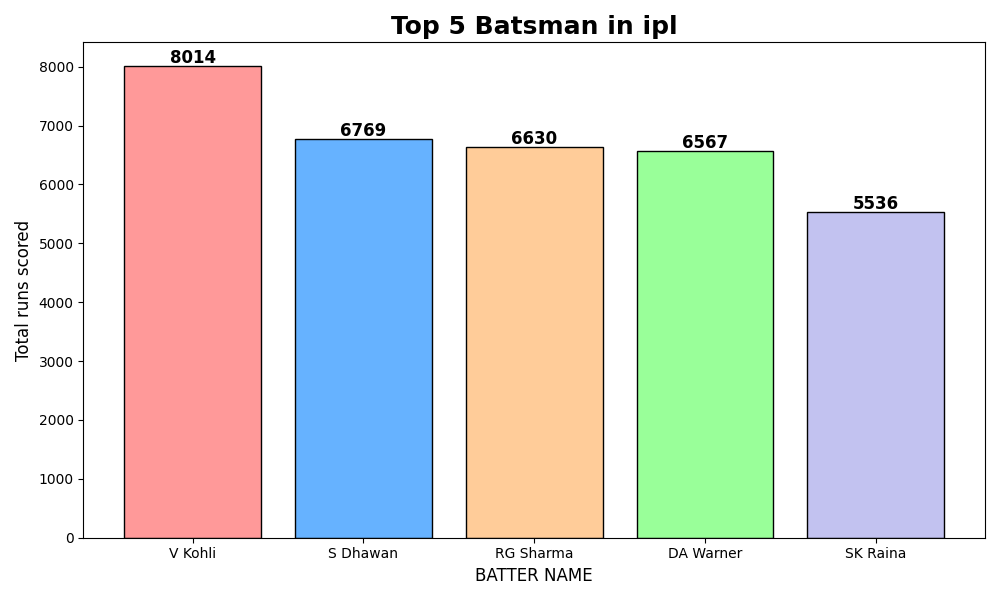
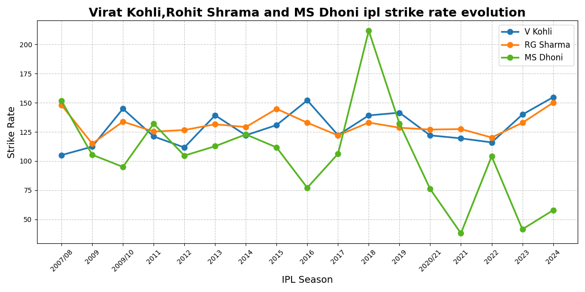
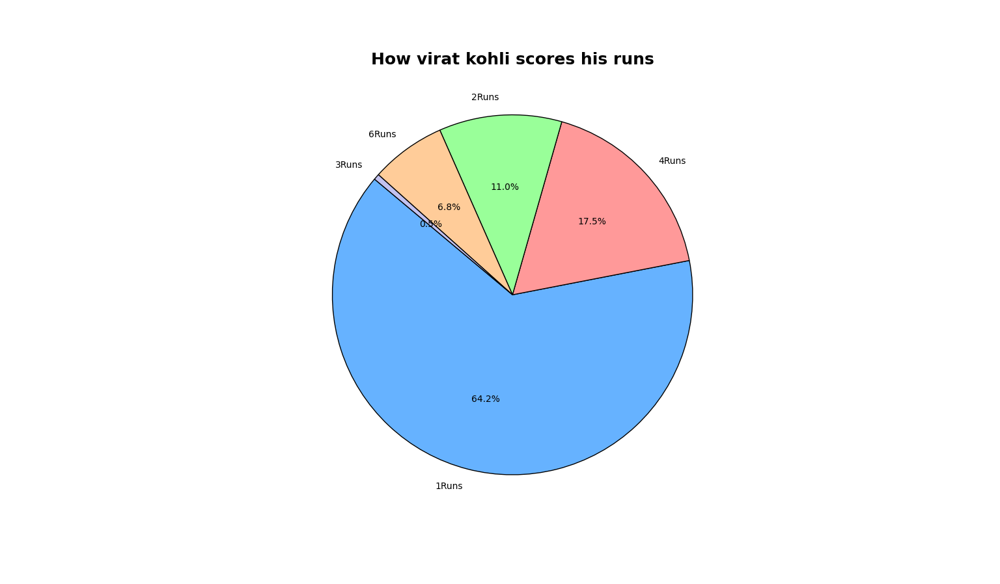

# 🏏 IPL Data Analytics Engine (2008 - 2024)

## 📌 Project Overview
This project is an automated Exploratory Data Analysis (EDA) pipeline built in Python. It ingests, cleans, and analyzes over 250,000 rows of Indian Premier League (IPL) ball-by-ball delivery data to generate a comprehensive terminal dashboard of historical player metrics, team statistics, and career trajectories. 

This project was built as part of my practical AIML coursework at NIE Mysuru to demonstrate advanced data engineering and vectorized mathematics.

## ⚙️ Tech Stack
* **Language:** Python 3
* **Data Manipulation:** Pandas (Merging, Grouping, Boolean Masking, Imputation)
* **Mathematical Operations:** NumPy (Vectorization, Array Logic)
* **Data Visualization:** Matplotlib (Time-Series Line Graphs, Categorical Bar Charts, Pie Charts)

## 🛠️ Engine Modules

The primary script (`ipl_comprehensive_analysis.py`) automates the extraction of insights across several domains:

1. **Batting Masterclass:** Calculates the 8,000+ run club, top boundary hitters (4s and 6s), and tracks "ducks" across 16 seasons.
2. **Fielding & Bowling Records:** Filters specific dismissal mechanisms to rank the top 5 wicket-takers, alongside specialized fielding metrics (e.g., MS Dhoni's stumpings, Virat Kohli's catches).
3. **Advanced NumPy Metrics:** Bypasses slow `for-loops` using vectorized NumPy array math to calculate mathematically true, year-over-year Strike Rates by safely filtering out 'wides' and dividing runs by legal deliveries.
4. **Targeted Deep Dives:** Includes a dynamic module to extract single-season performance metrics for specific players (e.g., Virat Kohli's legendary 2016 season).

## 📊 Visual Analytics Portfolio

### 1. The 8K Club: Top 5 Run Scorers

**Logic Highlight:** Utilized Pandas `.sort_values()` and `.head()` to rank the dataset, alongside a dynamic Matplotlib `enumerate()` loop to mathematically place text labels exactly above each bar.

### 2. The Head-to-Head: Career Strike Rate Evolution

**Logic Highlight:** Applied boolean masking (`!= 'wides'`) to ensure statistical accuracy before applying NumPy vector math to calculate true strike rates `(runs / legal_balls * 100)` across 16 seasons. 

### 3. Scoring Breakdown: Parts of a Whole

**Logic Highlight:** Used `.value_counts()` and Matplotlib's `autopct` to dynamically calculate the exact percentage distribution of scoring shots (1s, 2s, 4s, 6s).

## 🚀 How to Run Locally

1. Clone this repository to your local machine.
2. Ensure you have the required Data Science libraries installed:
   ```bash
   pip install pandas numpy matplotlib
